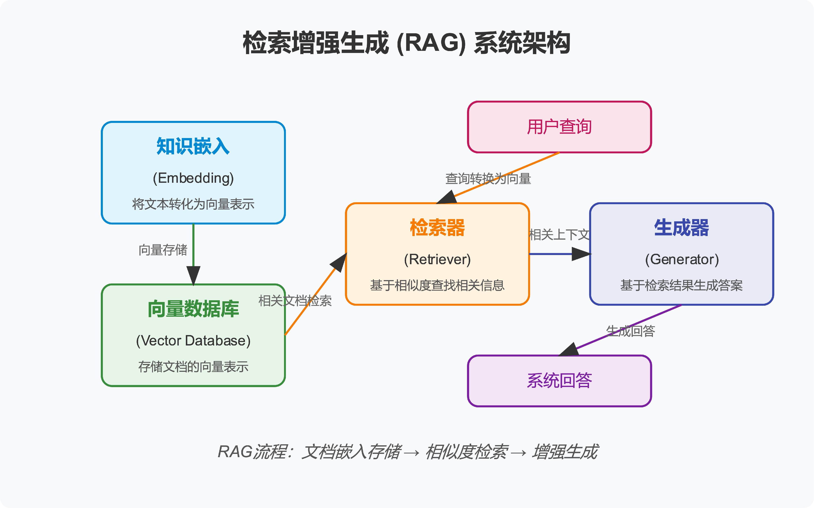

# happy-rag——RAG系统全链路实战
# 1. 环境搭建

## 创建并激活虚拟环境

```shell
conda create -n happy-rag python=3.12

conda activate happy-rag
```

## 安装依赖

```shell
pip install -r requirements.txt
```

## 生成当前项目依赖文件

```shell
 pipreqs .
```


# 2. RAG 系统整体架构



